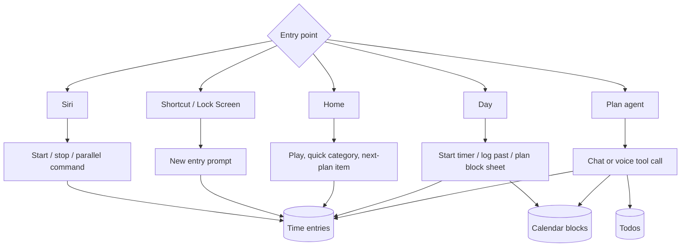
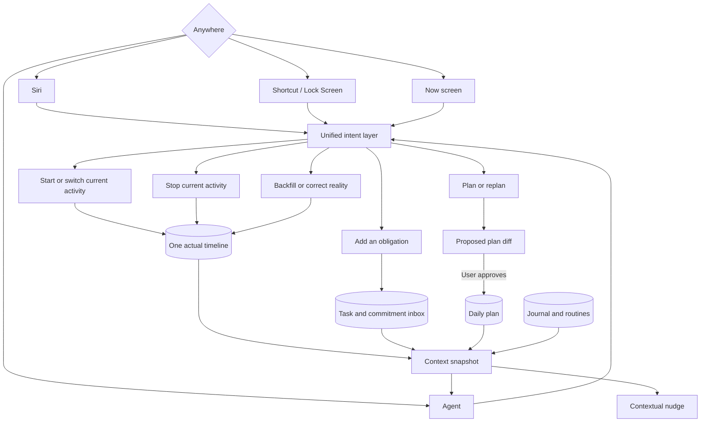
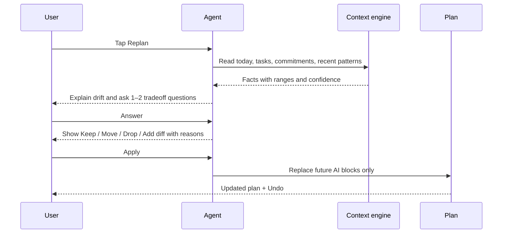

# LifeOS UX Flow Redesign

_Product proposal — 2026-07-03. No implementation is implied by this document._

## Executive decision

LifeOS should be optimized for one personal operating loop:

1. **Capture reality** with almost no friction.
2. **See what is happening now and what is next.**
3. **Repair gaps** by telling the agent what happened.
4. **Plan or replan** through a short conversation and approve a visible change set.
5. **Review and learn** from a small number of evidence-backed observations.

The feature set is not fundamentally wrong. The problem is that too much of the data model is exposed before a basic action can be completed. Categories, tags, tasks, notes, time correction, recurrence, last-stop recovery, and parallelism are useful, but most belong after capture or behind one **More options** disclosure.

The recommended product principle is:

> Capture first. Infer or enrich second. Ask only when the answer changes what happens next.

## The primary user goal

The app is successful when it helps the owner do these four things consistently:

- Track the whole day, including correcting forgotten periods later.
- Create a realistic daily plan from tasks, commitments, routines, and recent behavior.
- Replan the remaining day when reality diverges from the plan.
- Remember obligations and turn accumulated data into useful, appropriately cautious guidance.

Everything else is supporting capability. It should not compete with these goals in the primary UI.

## Current interaction map

Each entry point uses a slightly different control vocabulary. The user has to remember where an action lives and which fields are required. The unified Day sheet then asks the user to choose a mode before completing the underlying intent.

### What is already strong

- Siri, Shortcuts, Lock Screen, Live Activities, Home, Day, and Agent are already connected to the same underlying data.
- The agent can start and stop timers, log past time, edit entries, manage blocks, and add or complete tasks.
- Cross-midnight backfill is supported.
- Replan-from-now already preserves the past and only replaces future AI plan items.
- Tasks can link to plan blocks and time entries, and tracked completion can complete a task.
- The current Home screen is visually restrained.

### Where the current experience breaks down

- The user has to choose among **Start timer / Log past / Plan block** even when context already reveals the answer.
- A simple start can expose category, task, tags, name, notes, start time, last-stop recovery, and parallelism.
- Home, Day, Siri, Shortcuts, and Agent have overlapping but non-identical ways to start work.
- Six bottom-level destinations dilute the three daily destinations that matter.
- Plan and Tasks are combined, but the **Plan** label understates the agent's actual role.
- The planner sees the current plan and open tasks, but it does not automatically receive a reliable summary of sleep, gym, food, recent adherence, commitments, or journal context.
- Insights are displayed as a dashboard rather than being selectively used to improve a decision.
- Parallel timers undermine the cleanest possible mental model for full-day coverage: one person, one current primary activity, one wall-clock timeline.

## Proposed operating model

All entry points should call the same intent layer. An action should behave identically regardless of whether it originated from Home, Siri, a Shortcut, or Agent.

## Navigation recommendation

Use three primary destinations:

1. **Now** — current activity, next commitment, tracking gaps, and the one action needed now.
2. **Timeline** — inspect and repair actual time; view the plan as a secondary layer.
3. **Agent** — converse, plan/replan, backfill, add tasks, and review the day.

Inside Agent, retain a secondary **Agent / Tasks** switch. Rename the existing Plan destination to **Agent**.

- Move Week into a date-range control inside Timeline.
- Move Insights into weekly review and an optional detail screen rather than permanent bottom navigation.
- Move Settings behind a gear/profile control.
- Do not delete these features; reduce their navigation priority.

## Now screen

Now is not another dashboard. It is a state-driven control surface. It should show at most one primary action and one secondary action.

### When idle

Show:

- Current status: **Nothing tracking**.
- Best next suggestion from the plan, recent activities, or due commitments.
- Primary action: **Start**.
- Secondary action: **Talk to Agent**.

Tapping Start should show a small suggestion sheet:

- Next planned item.
- Two or three recent/relevant activities.
- A single text field: **What are you doing?**

Starting must not require a category. Infer it, use a predictable fallback, and place uncertain captures in Review.

### When tracking

Show:

- Activity title and elapsed time.
- Primary action: **Switch**.
- Secondary action: **Stop**.
- The next fixed commitment, if relevant.

Switch means “stop the current activity at this instant and start another.” It is the normal transition primitive and preserves a gap-free timeline.

### When a gap exists

Show one calm card:

> 1h 35m is untracked since Office ended. What happened?

Actions:

- **Tell Agent** — preferred; natural-language reconstruction.
- **Fill manually** — opens the gap with its start/end already fixed.

“Set to last stop time” should become automatic gap behavior, not a prominent form control.

### When the plan has drifted

Show:

> The plan is about 70 minutes behind. Replan the rest of today?

Actions:

- **Replan**.
- **Not now**.

Do not add a permanent Replan button when the plan is still realistic.

## Capture rules

### Start or switch an activity

Required at capture time:

- Nothing, if starting the next planned activity.
- Otherwise, a title or selected suggestion.

Inferred or optional afterward:

- Category.
- Linked task.
- Tags.
- Notes.
- Corrected start time.

The immediate feedback should be a compact receipt with Undo/Edit, not a form that blocks the start.

### Stop an activity

One tap. Do not ask for metadata while the user is transitioning between activities.

After stopping, optionally show:

- **Start next** if a planned activity is due.
- **Switch to…** if a recent activity is highly likely.
- **Edit** for correction.

### Log forgotten time

Preferred path: tell the agent a story in one turn.

Example:

> I woke at 8, got ready until 8:40, drove to office by 9:20, and have worked since.

The agent should:

1. Inspect existing entries.
2. Present or execute the explicit backfill safely.
3. Continue the last activity as the current running timer.
4. State exactly what changed.
5. Highlight ambiguity instead of inventing a time.

Manual path: tap a timeline gap. Time is already known; show only activity/title first.

### Add a task or obligation

Capture remains title-only:

> Order grandfather's item.

The agent or later enrichment can add urgency, due date, duration, recurrence, or context. It should ask immediately only when a missing fact could cause the commitment to be missed.

## Parallel tasks: park them without deleting the capability

Add an Advanced setting:

> **Allow simultaneous timers** — Track more than one activity at the same time.

Recommended default and current user value: **Off**.

When off:

- Enforce at most one running timer across Home, Day, Agent, Siri, Shortcuts, deep links, and server-side functions.
- Starting a new activity always performs an atomic switch: stop current, start next.
- Hide “Run alongside current timer.”
- Hide parallel-specific Siri language and agent suggestions.
- Tell the planner not to create overlapping flexible tasks.
- Preserve and render historical overlaps; do not modify old data.
- Allow genuinely fixed external commitments to be represented, but flag conflicts rather than treating two flexible activities as simultaneously executable.

When on:

- Restore the existing maximum-two behavior and related controls.

This setting must be enforced below the UI. Hiding the checkbox alone would still allow Agent, Siri, or older shortcuts to create parallel timers.

## Planning flow

Planning should be a guided decision, not a blank chat and not an automatic calendar rewrite.

### Morning plan

Entry points:

- First meaningful app open after waking.
- Agent quick action: **Plan today**.
- Optional scheduled notification.

Agent preflight should collect a read-only context snapshot:

- Today's fixed commitments.
- Open and overdue tasks.
- Promises involving other people.
- Existing plan and current time.
- Recent sleep duration/consistency.
- Recent gym/work/study/food patterns based on actual entries and relevant tags.
- Yesterday's misses and journal notes.
- User goals, routines, protected anchors, and preferences.

Conversation:

1. State the important constraints and one or two observations.
2. Ask no more than two questions that change the plan.
3. Propose a realistic schedule.
4. Explicitly account for every due commitment: schedule, defer, delegate, or intentionally skip.
5. Show the proposal before Apply.

### Replan from now

The existing forward-only replacement behavior is correct. The missing layer is a deliberate tradeoff conversation and a visible diff.

Example:

> It is 11:20 and the morning is 1h50 behind. Your 3 PM meeting is fixed. You have skipped gym for three days, but your logged sleep averaged only 5h55 over the last four nights. Do you want a recovery-first plan or to protect a shorter gym session?

The agent must distinguish facts from judgment. It should say which dates/data support the observation and avoid medical conclusions from a few days of self-tracking.

### Plan item semantics

The planner needs three kinds of schedule content:

- **Fixed** — meetings, appointments, travel constraints. Do not move without asking.
- **Flexible** — work, study, gym, errands. The agent may move these in a proposed replan.
- **Protected anchor** — sleep, meals, medication, important routines. Move only within user-defined bounds and call out compromises.

This distinction is more useful than treating every calendar block identically.

## Tasks and commitments

Not every task needs a large time block, but every meaningful commitment needs a disposition.

Recommended task kinds:

- **Commitment** — a promise, deadline, or obligation involving another person.
- **Flexible task** — work that should be scheduled when capacity exists.
- **Reminder** — an action that should surface at the right moment but may take only a minute.
- **Someday** — retained without competing for today's attention.

Examples:

| User statement | Interpretation | Planning behavior |
|---|---|---|
| “Order the item grandfather asked for” | Commitment, short flexible action | Surface until acknowledged; allocate 5–15 minutes before its due date |
| “Wish her happy birthday” | Date-bound reminder | Prompt on the day; optional one-minute slot, not a large block |
| “I told my senior I would meet her today” | Fixed or windowed commitment | Planning cannot finalize until a time is confirmed or the user explicitly defers it |
| “Go to the gym” | Routine/flexible task | Schedule based on recent completion, recovery context, and constraints |

Task capture should still require only a title. The kinds above are agent/planner semantics, not four mandatory buttons in the quick-add UI.

## Agent context and memory palette

The current agent receives open tasks, the target day's blocks, categories, and tool access. That is not enough for the desired chief-of-staff behavior.

Build an explicit, inspectable context system rather than relying on an opaque chat history.

### 1. Profile

Stable user facts and preferences:

- Sleep target and preferred window.
- Work hours and commute patterns.
- Current goals.
- Planning style and protected routines.

### 2. Routines

Recurring expectations:

- Gym cadence and workout rotation, including last workout type.
- Meal anchors.
- Study targets.
- Weekly recurring commitments.

### 3. Commitments

Promises and obligations that must not disappear in a generic backlog:

- Person involved.
- Due date or time window.
- Importance.
- Current disposition.

### 4. Evidence snapshot

Computed, read-only context from actual data:

- Last 7/14/30 day category totals.
- Sleep start, end, duration, and consistency.
- Routine completion and last occurrence.
- Plan-versus-actual drift.
- Tracking gaps and data completeness.
- Overdue and repeatedly deferred tasks.

### 5. Journal

Daily factual summary plus subjective answers:

- Auto-generated timeline summary.
- What changed and why.
- Energy/mood or a small set of user-selected signals.
- Domain-specific follow-up, such as workout type or meal quality, only when relevant.

### Memory safety

- Stable memories should have source, confidence, creation date, and last-confirmed date.
- The user must be able to inspect, edit, forget, or pin memories.
- The agent should ask “Remember this?” for inferred long-lived facts.
- Computed observations should expire or recompute; they should not become permanent personality facts.
- Internal LifeOS evidence should drive personal recommendations. External web research should be used only when useful, cited, and clearly separated from personal data.

## Autonomous brain

The brain is not a chat window that waits for instructions. It owns a small set of ongoing responsibilities:

- Keep the actual timeline reasonably complete.
- Keep the remaining plan realistic.
- Prevent commitments and promises from being silently forgotten.
- Balance work, sleep, food, exercise, and protected routines using available evidence.
- Learn from plan-versus-actual differences and daily reviews.
- Avoid unnecessary interruptions and weak claims.

It wakes on meaningful events—starting or stopping an activity, creating a task, applying a plan, opening the app, nearing a commitment, or reaching a scheduled review point—and also performs periodic check-ins in case no event occurred.

Each brain cycle follows the same functional loop:

1. **Observe** current reality, plan, tasks, commitments, routines, memories, journal, and insight calculations.
2. **Assess** whether any responsibility is at risk and how strong the evidence is.
3. **Decide** whether to remain silent, surface information, ask a question, or propose an action.
4. **Act** within its permission level.
5. **Follow up** later until the concern is resolved, dismissed, superseded, or no longer relevant.
6. **Record why** it acted or stayed silent so behavior is inspectable.

The durable unit of accountability is an **open concern**, not a notification. Examples:

- “Timeline has an unresolved gap since 14:10.”
- “Meeting senior today has no time or explicit deferral.”
- “Remaining plan needs eight hours but only five are available.”
- “Gym has been missed three times, but sleep evidence suggests recovery may matter more.”

Each concern retains its evidence, importance, last action, next check, and resolution. This prevents the agent from sending one prompt and forgetting the issue.

The user should be able to inspect a simple **What LifeOS is watching** view inside Agent. It should show active concerns, recent autonomous decisions, and why the agent did or did not intervene.

### Permission levels

- Read and compute: autonomous.
- Create an insight or internal concern: autonomous.
- Surface a card or proactive notification: autonomous, subject to an attention budget.
- Ask a question or start a conversation: autonomous.
- Propose a plan/task change: autonomous.
- Apply a plan change, defer a commitment, or save a durable inferred memory: requires user approval.
- Execute an explicit user command such as start/stop/backfill: immediate, with a receipt and Undo where possible.

“Taking accountability” therefore means continuously monitoring, following up, explaining decisions, and not dropping unresolved concerns. It does not mean silently rewriting the user's day.

### Relationship to Insights

The current Insights engine should remain available as an informative screen. It already computes useful facts such as adherence, unplanned time, start drift, untracked time, category shortfalls, trends, calibration, consistency, and data-quality diagnoses.

Insights are the brain's instruments, not a replacement for the brain:

- The full Insights screen remains available on demand from Timeline through a clear analytics control.
- The agent can answer questions using the same calculations and link to the supporting detail.
- The brain evaluates insights automatically and surfaces only the ones that are relevant to a current decision.
- Important findings can appear proactively without waiting for the user to ask.
- Existing calculations remain deterministic; the language model interprets and prioritizes them rather than inventing the numbers.
- New longitudinal signals should cover routines, commitment risk, repeated deferral, sleep/gym/food balance, and evidence confidence.

## Proactive agent loop

Do not run an unconstrained autonomous loop. Use event-triggered, read-first checks.

Recommended triggers:

- **Morning:** first open after a detected/recorded wake → offer Plan today.
- **Tracking gap:** meaningful untracked period → ask for a backfill when convenient.
- **Plan drift:** current reality makes the remaining plan infeasible → offer Replan.
- **Commitment risk:** a due promise has no disposition → surface it before planning can finalize.
- **Evening:** likely end of day → offer a two-minute review and journal.
- **Weekly:** enough complete days exist → offer a concise review.

Autonomy levels:

- Explicit capture commands may execute immediately and return a receipt with Undo.
- The agent may read data and generate suggestions automatically.
- Plan changes require preview and approval.
- External or irreversible actions require explicit confirmation.

## Journal flow

The journal should be produced through conversation, not a blank writing screen.

Evening flow:

1. Agent generates a factual summary from the timeline and completed tasks.
2. It identifies one meaningful deviation from the plan.
3. It asks at most three adaptive questions.
4. It saves the summary and answers as the day's journal entry.
5. It carries only relevant information into tomorrow's planning context.

Example questions:

- “The office block ran two hours longer than planned. What caused that?”
- “How was your energy today, 1–5?”
- “You logged gym. Was this legs, push, pull, or something else?”

Do not ask about food, workout, mood, and every other domain every day. Rotate or trigger questions based on the actual day and current goals.

## Insights redesign direction

Insights should become input to action, not a wall of charts.

### During the day

Show at most one actionable observation on Now or during planning/replanning.

### Weekly review

Use three sections:

1. **Coverage** — how much of waking time was accounted for and where gaps remain.
2. **Plan vs actual** — the largest repeated source of drift.
3. **One experiment** — a concrete adjustment for the next week.

### Evidence rules

- Show the number of complete days behind an observation.
- Label low-confidence patterns.
- Do not infer causation from correlation.
- Hide or defer insight categories when data is insufficient.
- If an insight does not change a decision, it does not need top-level UI.

## UI rules

- One primary action and at most one secondary action in the main state area.
- Use context to choose the mode; do not make the user choose a mode the app already knows.
- Put advanced fields under one **More options** disclosure.
- Use system/sans typography for controls and dense information. Reserve display serif for one restrained headline if desired.
- Prefer neutral surfaces and clear contrast over large ceremonial empty states.
- Use plain verbs: Start, Switch, Stop, Fill gap, Replan, Add task.
- Every agent mutation gets a short receipt. Every plan application gets a diff and Undo.
- Preserve power features through edit/detail views instead of exposing all of them during capture.

## Concrete daily flows

### Normal tracked day

1. Siri/Shortcut/Home: “Start commute.”
2. Home shows Commute running.
3. At office, tap Switch and choose Office.
4. Next planned block appears when useful; tap it to switch.
5. Stop at the end of the day.
6. Agent offers a short review only if there is something to resolve.

### Forgot half the day

1. Open Agent from anywhere.
2. Say what happened in chronological language.
3. Agent reconciles with existing entries and highlights any ambiguity.
4. Missing periods are inserted and the present activity continues running.
5. Timeline displays the reconstructed day; uncertain entries remain in Review.

### Woke late

1. Home detects that the plan is no longer feasible and offers Replan.
2. Agent summarizes fixed commitments, remaining tasks, recent relevant patterns, and the capacity problem.
3. User answers one or two tradeoff questions.
4. Agent shows Keep/Move/Drop/Add.
5. User applies; only future AI blocks change.

### Capturing a promise

1. Tell Siri/Agent: “I promised my senior I would meet her today.”
2. It is captured immediately as a commitment.
3. If time is missing, Agent asks once or marks it as needing clarification.
4. Planning cannot silently omit it; the user must schedule or defer it.

## Recommended implementation order

### Phase 1 — Reduce fear and enforce one reality

- Add `allowParallelTimers`, default Off, and enforce it in every start path.
- Rename Plan to Agent.
- Reduce primary navigation to Now / Timeline / Agent.
- Make Start and Stop minimal; place enrichment behind More options/edit.
- Add contextual Home cards for tracking gaps and plan drift.
- Keep existing functionality reachable; change exposure before deleting capability.

### Phase 2 — Make planning intelligent

- Add fixed/flexible/protected plan semantics.
- Add commitment/reminder semantics to tasks.
- Build a read-only context snapshot service.
- Change Replan into a context preflight, short tradeoff discussion, and visible diff.
- Add Apply undo/audit trail if it is not already sufficient.

### Phase 3 — Build memory and review

- Add user-controlled Profile, Routines, Commitments, and inspectable memories.
- Add conversational daily journal and adaptive prompts.
- Feed journal and evidence snapshots into planning.
- Replace the broad Insights surface with daily contextual observations and a concise weekly review.

### Phase 4 — Proactive behavior

- Add event-triggered morning, gap, drift, commitment-risk, evening, and weekly checks.
- Tune thresholds from actual personal use.
- Add external research capability only with citations and explicit separation from personal evidence.

## Acceptance criteria

- Starting a likely activity takes one tap; starting an arbitrary activity takes at most two interactions after opening the relevant entry point.
- Stopping takes one tap.
- Switching creates a continuous handoff with no overlap when simultaneous timers are disabled.
- Backfilling a normal forgotten sequence works in one spoken turn plus a clear receipt or ambiguity question.
- Replanning is reachable in one tap when relevant, asks at most two initial questions, and never changes the calendar before showing a diff.
- Due commitments cannot be silently omitted from a finalized plan.
- No primary capture surface exposes more than one advanced disclosure.
- Insights state their evidence window and confidence.
- The user can inspect and delete every durable agent memory.

## Research basis

- [Toggl Track Timer Mode](https://support.toggl.com/timer-mode) starts tracking first and lets the user fill description/project/tag details while the timer is already running. This supports capture-before-enrichment.
- [Timery](https://timeryapp.com/) emphasizes one-tap saved/recent timers, widgets, Siri/Shortcuts, Live Activities, and starting from the last stop time. This supports relevant suggestions and access from outside the app.
- [Sunsama Daily Planning](https://help.sunsama.com/docs/usage-guides/daily-planning/) uses a guided ritual: reflect on yesterday, select tasks, check predicted workload, defer excess work, and finalize. It also permits rerunning planning when priorities shift.
- [Motion auto-scheduling](https://www.usemotion.com/help/time-management/auto-scheduling) distinguishes flexible tasks that can move from fixed events that cannot, and reschedules around constraints. LifeOS should adopt the distinction but retain explicit approval for personal replans.
- [WHOOP Journal](https://support.whoop.com/s/article/WHOOP-Journal-Overview?language=en_US) uses consistent prompts, recommends limiting tracked behaviors to avoid overload, and withholds behavior-impact insights until sufficient data exists. This supports adaptive journaling and evidence thresholds.
- [Apple App Intents](https://developer.apple.com/documentation/appintents/app-intents) exposes structured actions to Siri and Shortcuts, validating a shared intent layer rather than separate entry-point behavior.
- [Apple disclosure-control guidance](https://developer.apple.com/design/human-interface-guidelines/disclosure-controls) recommends keeping common actions visible, hiding advanced functionality until relevant, and avoiding multiple disclosures in one view.
- [OpenAI Agents SDK sessions](https://openai.github.io/openai-agents-js/guides/sessions/) provide persistent conversation state; its [human-in-the-loop flow](https://openai.github.io/openai-agents-js/guides/human-in-the-loop/) can pause tool actions for approval and resume them later, while [tracing](https://openai.github.io/openai-agents-js/guides/tracing/) records model and tool activity for inspection.
- [Supabase Cron](https://supabase.com/docs/guides/cron), [Queues](https://supabase.com/docs/guides/queues), and [Database Webhooks](https://supabase.com/docs/guides/database/webhooks) provide scheduled wake-ups, durable event delivery, and reactions to data changes without adding a separate orchestration platform.
- [LangGraph interrupts](https://docs.langchain.com/oss/javascript/langgraph/interrupts) and [Inngest durable functions](https://www.inngest.com/docs/learn/inngest-functions) are viable alternatives for durable pause/resume and event-driven workflows, but are additional infrastructure rather than a missing intelligence layer.

---

## Decisions and revised plan — 2026-07-04 (user + Claude Code)

Product review of this proposal produced the following decisions. Where this section conflicts with the body above, this section wins.

### Decisions

1. **Navigation: three tabs, but Tasks lives with Timeline, not Agent.**
   Agent and Tasks are different surfaces and must not merge. Tasks belong next to the plan/timeline because tasks feed the plan. Final structure:
   - **Now** — evolved from the current Home screen (do not rebuild; add state cards). Settings behind a gear here.
   - **Day · Tasks** — one tab with a segmented control at top. Named **Day** (not Timeline) to avoid nested "Timeline | Timeline" confusion, because the inner Day view has its own **Timeline ↔ List** toggle. Selected date is preserved across both segments; both keep separate routes for deep links. Insights reachable from an analytics control inside Day. Note (Codex review): the Plan/Tasks segmented pattern was split into separate screens by later commits, so this is a new composition, not simple reuse.
   - **Agent** — chat only (already shipped as its own tab).

2. **Day view gets a Timeline ↔ List toggle (Toggl-style).**
   Current Day renders blocks proportionally (`pxPerHour`); a 3-minute entry is invisible. Add a list mode: fixed-height rows of `● title · category · HH:MM–HH:MM · duration`, gaps rendered as their own tappable rows ("25m untracked — fill"). Timeline mode stays default; remember the last-used mode. Plan-vs-actual layering stays timeline-only initially.
   Spec rules (Codex review): gaps only between recorded entries and up to *now* — never render future time as a gap; handle cross-midnight and still-running entries; render historical parallel overlaps grouped, sorted by start; suppress sub-minute rounding gaps (reuse the existing 1-minute tolerance); tapping a gap opens capture with start/end pre-fixed. Reuse the interval-merge/gap primitives in `app/src/lib/planVsActual.ts`; do not write second gap arithmetic.

3. **Smarter agent model.**
   `plan-chat` currently runs `gpt-4.1-mini`. Upgrade the planner/replanner paths to a top-tier reasoning model — as a *controlled* swap, not blind: first build a small representative eval set (plan, replan, backfill conversations) and compare correctness, latency, tool rounds, cost. Phase 0 also hardens tool guards, because a more capable model raises mutation risk: extend ID allowlisting to entry/block mutations (today only category/todo IDs are allowlisted), extend date clamping to all tools, and make the `start_timer` tool perform an atomic switch instead of a bare insert. Cheap-model router deferred until traffic justifies it.

4. **Brain notifications: default to proactive push.**
   User expectation: without push notifications the system will be forgotten. So notifications default ON (after OS permission). But not "pushy then dial down" — mediocre pushes train dismissal fast. Requirements: concern-level dedup, cooldowns, urgency tiers, bundling, actionable deep links, server-side atomic attention-budget enforcement, quiet hours with timezone/DST handling and commitment-emergency exceptions.
   Infrastructure reality (Codex review): existing APNs support is ActivityKit push-to-start only; `runawayNotify.ts` is local notifications. Ordinary remote push needs device-token registration + delivery transport (Expo push service is the low-effort option) — this must be built *before* Phase 4, not inside it.

5. Confirmed from earlier discussion: Now = evolution of Home (not a new screen); parallel timers parked behind `allowParallelTimers` (default Off) enforced below the UI.
   **Insights placement is an open question, not a user requirement** (earlier log overstated this as a firm preference). Working default: keep the full Insights screen one tap away via the analytics control inside Day, and let the brain use the same calculations as sensors. Revisit after Phase 4 — if the brain reliably surfaces the useful observations contextually, the standalone screen can be demoted further.

### Revised implementation order

**Phase 0 — Model upgrade + tool hardening (independent, do first)**
- Build a small eval set of representative plan/replan/backfill conversations; run against current model as baseline.
- Harden `plan-chat` tools: entry/block ID allowlisting, date clamping on all tools, atomic switch in `start_timer`.
- Swap MODEL to the chosen top-tier model; compare eval correctness, latency, tool rounds, cost.

**Phase 1 — One reality + capture simplification**
- **Server-backed `user_settings` table** (moved up from Phase 4 — settings are AsyncStorage-only today, so DB triggers and edge functions cannot read them). Holds `allowParallelTimers`, later quiet hours/budgets.
- `allowParallelTimers` (default Off) enforced in DB trigger, voice/track edge functions, agent tools, and all client start paths; hide parallel UI and Siri "parallel/also/and" parsing when off.
- Day unified sheet: infer mode from context (gap tapped → backfill; nothing running → start; future slot → plan block); title-first capture; everything else behind one More options / post-hoc edit.
- Day Timeline ↔ List toggle (spec rules in Decisions §2).
- Nav restructure to Now / Day·Tasks / Agent; gap + drift state cards on Now.

**Phase 2 — Planning intelligence**
- Fixed / flexible / protected-anchor semantics on plan blocks; commitment / flexible / reminder / someday semantics on todos — including **minimal routines/commitments schemas** so the snapshot below has real inputs (full UI still Phase 3).
- Server-side deterministic context-snapshot service, limited to data that exists by end of Phase 2 (sleep, category totals, adherence, commitments); journal carry-over joins in Phase 3.
- Replan = context preflight → ≤2 tradeoff questions → visible Keep/Move/Drop/Add diff → apply (future-only) → undo.

**Phase 3 — Memory + journal + push transport**
- Profile / Routines / Commitments UI + inspectable memories (source, confidence, created, last-confirmed; user can edit/forget/pin).
- Evening conversational journal (factual summary + ≤3 adaptive questions) feeding next-day planning.
- **Remote push transport** (device-token registration + delivery, likely Expo push) and notification settings (budget, quiet hours, per-trigger toggles) — built and tested here so Phase 4 is orchestration only.

**Phase 4 — Autonomous brain**
- `concerns` table (evidence, importance, last action, next check, resolution) as the durable unit.
- Triggers via Supabase Cron + database webhooks + app events; brain reads insights calculations as sensors.
- Proactive notifications over the Phase-3 transport with dedup, cooldowns, urgency tiers, bundling, deep links, server-side budget enforcement.
- "What LifeOS is watching" view inside Agent: active concerns, recent autonomous decisions, and why it acted or stayed silent.

### Notifications system design — 2026-07-04

User-requested feature set: plan-block reminders (1–3 per block, configurable lead times like 5/15 min), task reminders with their own lead times, sound choice per type, plan-tomorrow / replan-today ritual nudges, long-running-timer alert (exists as `runawayNotify`, local), agent able to add its own reminders, and a visible queue of upcoming notifications.

**Architectural split.** iOS local scheduled notifications fire even when the app is killed. Everything above except "agent schedules a reminder while the app is closed and it must arrive before the app is next opened" works with local notifications only. Therefore:

- **v1 (local, no new server infrastructure)** — ships after Phase 1, before Phase 2/3.
- **v2 (remote)** — rides on the Phase 3 push transport; adds delivery for agent/brain notifications while the app is closed, plus server-side dedup/budget for brain concerns (Phase 4).

**Source of truth: one queue table.** `scheduled_notifications` (Supabase): `id, user_id, source ('plan_block'|'task'|'ritual'|'agent'|'system'), ref_id (block/todo id), fire_at, title, body, sound, status ('pending'|'fired'|'cancelled'), created_by ('system'|'agent'|'user')`.

- **Derived rows** (plan-block reminders, task reminders, rituals) are regenerated by a client-side reconciler from calendar blocks + todos + settings whenever data changes — same pattern as the existing `reconcileLiveActivities`. Never hand-edited; plan changes automatically move the reminders.
- **Direct rows** (agent tool `add_reminder`/`cancel_reminder`, manual one-offs) live in the table as-is.
- The client reconciler merges both, applies quiet hours, and schedules OS local notifications for a rolling window (iOS caps ~64 pending local notifications — schedule the next 48h and refresh on foreground).

**v1 known limitation (accepted):** if the agent adds/changes reminders while the app is closed, OS schedules update only on next app open. v2 remote push removes this.

**Settings (in the server-backed `user_settings` from Phase 1):**
- Plan-block reminders: on/off, 1–3 offsets (e.g. 15 min + 5 min before each block), sound.
- Task reminders: on/off, own offsets relative to due time, sound.
- Rituals: plan-tomorrow nudge (time, e.g. 21:30), replan-today nudge (on/off, drift-triggered: v1 checks plan-vs-actual drift on app foreground using the existing `planVsActual` calculations and surfaces the Replan card/notification past a threshold, e.g. >45 min behind; Phase 4 brain adds background drift detection while the app is closed), sound.
- Long-running timer: threshold (exists; fold its setting in here).
- Quiet hours.

**UI:**
- **Settings → Notifications** screen: the controls above.
- **Notification Center**: bell icon on Now header → upcoming queue, soonest-first, each row `source icon · title · fires at HH:MM`, swipe to cancel; fired ones drop off; agent-created rows labeled. Gear in its header jumps to the settings screen.

**Sounds:** bundled `.caf`/`.wav` assets via expo-notifications config plugin; per-type picker. Requires a new native build (IPA) — batch with the next scheduled build.

**Agent integration:** new `plan-chat` tools `add_reminder(title, fire_at, body?)` and `cancel_reminder(id)` writing direct rows, with the same date-clamp + ID-allowlist guards as other tools.

**Execution order for v1:**
1. Migration: `scheduled_notifications` + `user_settings` notification fields.
2. Client reconciler (derive → merge → schedule local, rolling window, quiet hours). Reuse `runawayNotify`'s expo-notifications wiring.
3. Settings → Notifications screen.
4. Notification Center queue view + bell on Now.
5. Agent tools + guards.
6. Sound assets + picker + native rebuild.

### Open questions

- Final model pick + whether to add the cheap-model router in Phase 0 or later.
- Notification defaults: attention budget size and quiet hours.
- List mode as default vs timeline default (currently: timeline default, sticky preference).
- Where exactly Notifications v1 slots: immediately after Phase 1 (recommended — it depends on `user_settings`) or in parallel with Phase 2.
